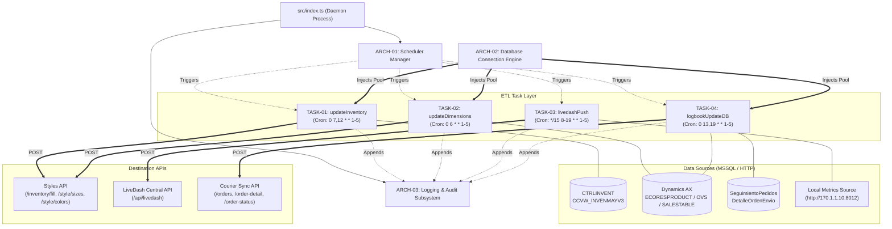

# Carnival Job Runner — Master Documentation Index

Welcome to the central documentation index for **Carnival Job Runner**. This directory contains atomic specifications designed for **Spec-Driven Development (SDD)** and instant AI context acquisition.

> **Navigation Shortcuts**:
> [**Quickstart Guide**](file:///home/osvaldev/Documents/carnival/job-runner/docs/QUICKSTART.md) | [**Workflow & Change Matrix**](file:///home/osvaldev/Documents/carnival/job-runner/docs/WORKFLOW.md) | [**AI Agent Protocol**](file:///home/osvaldev/Documents/carnival/job-runner/AGENTS.md) | [**Project README**](file:///home/osvaldev/Documents/carnival/job-runner/README.md)

---

## 1. System Architecture Topology

The following diagram outlines the entire system network: the scheduler daemon triggers decoupled tasks, which acquire MSSQL database connections, extract records, transform them into strongly typed payloads, and push them to external REST APIs.



---

## 2. Master Node Registry

Use this registry to immediately jump to the exact specification you need.

### Architectural Nodes (`docs/arch/`)

| Node ID | Subsystem Name | Primary Files | Upstream / Driver | Downstream Consumers |
| :--- | :--- | :--- | :--- | :--- |
| [ARCH-01](file:///home/osvaldev/Documents/carnival/job-runner/docs/arch/ARCH-01-SCHEDULER.md) | **Scheduler & Process Lifecycle** | [`src/index.ts`](file:///home/osvaldev/Documents/carnival/job-runner/src/index.ts)<br>[`src/scheduler/*`](file:///home/osvaldev/Documents/carnival/job-runner/src/scheduler/index.ts) | Node.js, `node-cron`, PM2 | All tasks in `src/tasks/*` |
| [ARCH-02](file:///home/osvaldev/Documents/carnival/job-runner/docs/arch/ARCH-02-DATABASE.md) | **MSSQL Database Engine** | [`src/config/database.ts`](file:///home/osvaldev/Documents/carnival/job-runner/src/config/database.ts)<br>[`src/config/env.ts`](file:///home/osvaldev/Documents/carnival/job-runner/src/config/env.ts) | `mssql` pool driver | `TASK-01`, `TASK-02`, `TASK-04` |
| [ARCH-03](file:///home/osvaldev/Documents/carnival/job-runner/docs/arch/ARCH-03-LOGGING.md) | **Logging & Audit Subsystem** | [`src/utils/logger.ts`](file:///home/osvaldev/Documents/carnival/job-runner/src/utils/logger.ts) | Node `fs`, `console` | All tasks and scheduler |

### Task Specification Nodes (`docs/tasks/`)

| Node ID | Task Name | Status | Cron Expression | Source File(s) | Primary Output Target |
| :--- | :--- | :--- | :--- | :--- | :--- |
| [TASK-01](file:///home/osvaldev/Documents/carnival/job-runner/docs/tasks/TASK-01-UPDATE-INVENTORY.md) | **Inventory Sync** | Active | `0 7,12 * * 1-5` | [`src/tasks/updateInventory/*`](file:///home/osvaldev/Documents/carnival/job-runner/src/tasks/updateInventory/index.ts) | `STYLES_API_BASE_URL/inventory/fill` |
| [TASK-02](file:///home/osvaldev/Documents/carnival/job-runner/docs/tasks/TASK-02-UPDATE-DIMENSIONS.md) | **Product Dimensions & Sizing** | Standby | `0 6 * * 1-5` | [`src/tasks/updateDimensions/*`](file:///home/osvaldev/Documents/carnival/job-runner/src/tasks/updateDimensions/index.ts) | `STYLES_API_BASE_URL/style/sizes`, `/colors` |
| [TASK-03](file:///home/osvaldev/Documents/carnival/job-runner/docs/tasks/TASK-03-LIVEDASH-PUSH.md) | **LiveDash Metrics Push** | Standby | `*/15 8-19 * * 1-5` | [`src/tasks/livedashPush/*`](file:///home/osvaldev/Documents/carnival/job-runner/src/tasks/livedashPush/index.ts) | `LIVEDASH_TARGET_URL` |
| [TASK-04](file:///home/osvaldev/Documents/carnival/job-runner/docs/tasks/TASK-04-LOGBOOK-SYNC.md) | **The Courier (Orders & Logistics)** | Standby | `0 13,19 * * 1-5` | [`src/tasks/logbookUpdateDB/*`](file:///home/osvaldev/Documents/carnival/job-runner/src/tasks/logbookUpdateDB/index.ts) | `SYNC_API_URL/orders`, `/order-detail`, `/order-status` |

---

## 3. Crontab Execution Schedule Matrix

All cron intervals operate in the local server timezone during regular Mexican workdays (Monday through Friday):

```
06:00 AM  ──► [TASK-02] Update Dimensions (Extracts Master ECORESPRODUCT sizes & colors)
07:00 AM  ──► [TASK-01] Update Inventory (Morning stock synchronization)
08:00 AM  ──► [TASK-03] LiveDash Metrics (Runs every 15 min until 07:00 PM)
12:00 PM  ──► [TASK-01] Update Inventory (Midday stock refresh)
01:00 PM  ──► [TASK-04] The Courier Sync (Midday orders, tracking & packing progress)
07:00 PM  ──► [TASK-04] The Courier Sync (End-of-day orders & invoice reconciliation)
```

---

## 4. Templates for Extending the System

To maintain architectural integrity, always use the pre-built templates when adding components:
* **New Task / Job Node**: [docs/templates/task-node.template.md](file:///home/osvaldev/Documents/carnival/job-runner/docs/templates/task-node.template.md)
* **New Subsystem / Architecture Node**: [docs/templates/arch-node.template.md](file:///home/osvaldev/Documents/carnival/job-runner/docs/templates/arch-node.template.md)
