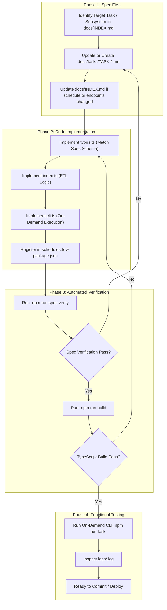

# Spec-Driven Development (SDD) Workflow & Change Governance

This document establishes the mandatory operational workflow for both **human software engineers** and **AI coding assistants** working on `carnival-job-runner`.

---

## 1. Core Principles of Spec-Driven Development (SDD)

1. **The Specification is the Single Source of Truth**:
   Code is an executable realization of the specification, not the reverse. If code diverges from the spec without an intentional spec update, the code is considered defective.
2. **Contract First**:
   Before modifying existing task behavior or introducing a new feature, the relevant specification node **must** be written or updated first.
3. **Zero Drift Guarantee**:
   Cron expressions, active/disabled toggles, input schemas, and output payloads must remain 100% synchronized across TypeScript source files, test scripts, and documentation nodes.

---

## 2. Change Trigger Matrix

Whenever a component or file in this codebase is modified, consult the matrix below to determine which specification nodes and documentation files **MUST** be updated.

| If you modify... | Affected Code Files | Mandatory Spec Node to Update | Documentation to Sync |
| :--- | :--- | :--- | :--- |
| **Cron schedule or Task toggle** | `src/scheduler/schedules.ts` | `docs/tasks/TASK-XX-<NAME>.md`<br>(frontmatter `schedule` & `status`) | [`docs/INDEX.md`](file:///home/osvaldev/Documents/carnival/job-runner/docs/INDEX.md)<br>(Section 2 Registry & Section 3 Crontab Matrix) |
| **SQL query, view, or columns** | `src/tasks/<task>/index.ts`<br>`src/tasks/<task>/types.ts` | `docs/tasks/TASK-XX-<NAME>.md`<br>(Section 4 Extract & Section 5 Transform) | — |
| **Target API payload or endpoint** | `src/tasks/<task>/index.ts`<br>`src/tasks/<task>/types.ts`<br>`src/config/env.ts` | `docs/tasks/TASK-XX-<NAME>.md`<br>(Section 6 Load Contract) | [`docs/INDEX.md`](file:///home/osvaldev/Documents/carnival/job-runner/docs/INDEX.md)<br>(Section 1 Topology & Section 2 Registry) |
| **Database pool, timeouts, credentials** | `src/config/database.ts`<br>`src/config/env.ts` | [`docs/arch/ARCH-02-DATABASE.md`](file:///home/osvaldev/Documents/carnival/job-runner/docs/arch/ARCH-02-DATABASE.md)<br>(Section 3 API & Section 4 Config) | — |
| **Logging behavior or log directory** | `src/utils/logger.ts`<br>`logs/README.md` | [`docs/arch/ARCH-03-LOGGING.md`](file:///home/osvaldev/Documents/carnival/job-runner/docs/arch/ARCH-03-LOGGING.md)<br>(Section 3 API & Section 4 Storage) | — |
| **Daemon lifecycle, signals, or PM2** | `src/index.ts`<br>`src/scheduler/index.ts`<br>`ecosystem.config.cjs` | [`docs/arch/ARCH-01-SCHEDULER.md`](file:///home/osvaldev/Documents/carnival/job-runner/docs/arch/ARCH-01-SCHEDULER.md)<br>(Section 2 Lifecycle & Section 4 PM2) | — |
| **Adding a brand new task** | `src/tasks/<newTask>/*`<br>`src/scheduler/schedules.ts`<br>`package.json` | Create `docs/tasks/TASK-XX-<NAME>.md`<br>(from `docs/templates/task-node.template.md`) | [`docs/INDEX.md`](file:///home/osvaldev/Documents/carnival/job-runner/docs/INDEX.md)<br>(Add to Registry & Schedule Matrix) |

---

## 3. The 4-Phase Execution Process



### Detailed Phase Steps

#### Phase 1: Spec First
1. Open [`docs/INDEX.md`](file:///home/osvaldev/Documents/carnival/job-runner/docs/INDEX.md) and find the relevant node.
2. If modifying an existing task, edit the corresponding file in `docs/tasks/TASK-*.md`.
3. If creating a new task, copy [`docs/templates/task-node.template.md`](file:///home/osvaldev/Documents/carnival/job-runner/docs/templates/task-node.template.md) to `docs/tasks/TASK-XX-<TASKNAME>.md` and define the Input Contract (SQL), Transform Rules, and Output Contract (JSON Payload).
4. If the cron expression or enabled status is changing, update the frontmatter and update `docs/INDEX.md`.

#### Phase 2: Code Implementation
1. Define interfaces in `src/tasks/<taskName>/types.ts` mirroring the spec.
2. Implement the extraction, transformation, and API call in `src/tasks/<taskName>/index.ts`.
3. Create `src/tasks/<taskName>/cli.ts` for on-demand execution.
4. Register the task in [`src/scheduler/schedules.ts`](file:///home/osvaldev/Documents/carnival/job-runner/src/scheduler/schedules.ts) and add the script in [`package.json`](file:///home/osvaldev/Documents/carnival/job-runner/package.json).

#### Phase 3: Automated Quality Gate
Execute the automated health and verification tool:
```bash
npm run spec:verify
```
This script checks:
* All `code_files` declared in specs exist.
* Cron schedules and `enabled` states in `src/scheduler/schedules.ts` match task frontmatters and `docs/INDEX.md`.
* Markdown cross-links are valid.

Then compile TypeScript:
```bash
npm run build
```

#### Phase 4: Functional Validation
Test the task independently via its dedicated CLI command:
```bash
npm run task:<taskName>
```
Verify output in the terminal and check the persistent audit trail in `logs/<taskName>.log`.

---

## 4. Pre-Commit / Pull Request Checklist

Before submitting changes, ensure the following checklist is completed:

- [ ] Target specification node in `docs/tasks/` or `docs/arch/` matches code 100%.
- [ ] If schedules changed, `docs/INDEX.md` was updated.
- [ ] `npm run spec:verify` passes with code `0`.
- [ ] `npm run build` succeeds without compiler warnings or errors.
- [ ] On-demand task CLI was executed and log verified in `logs/*.log`.
- [ ] Commit message strictly adheres to the Conventional Commits specification.

---

## 5. Conventional Commits & Git Hooks Enforcement

To guarantee commit history readability and automate release tagging, all commits must follow the **Conventional Commits** standard:

```text
<type>(<optional-scope>): <description>
```

### Allowed Types
* `feat`: A new background ETL worker, endpoint, or feature.
* `fix`: A bug fix or patch.
* `docs`: Updates to documentation, spec nodes, or diagrams.
* `refactor`: Code reorganization without functional changes.
* `perf`: Performance optimizations (e.g. chunking improvements).
* `test`: Adding or correcting tests or verification scripts.
* `chore`: Maintenance, dependencies, or configuration changes.

### Automated Git Hooks (`.githooks/`)
* **`pre-commit`**: Automatically runs `npm run spec:verify` and `npm run build`. Rejects the commit if drift or compiler errors exist.
* **`commit-msg`**: Validates the commit message format against the Conventional Commits regex. Rejects non-conforming messages.

