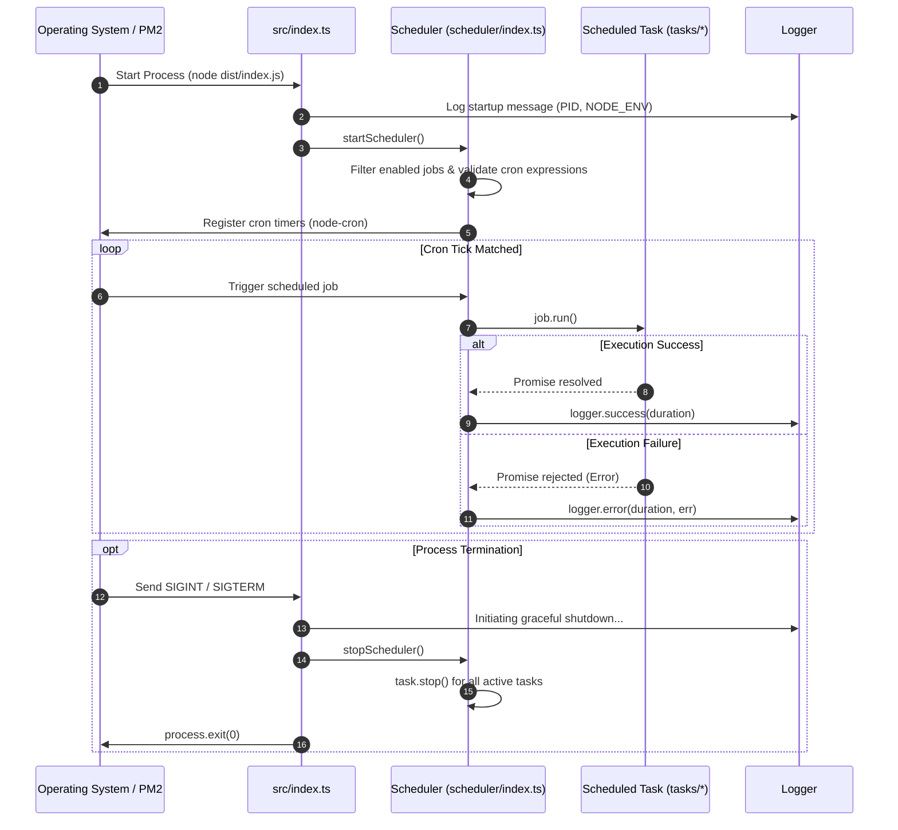

# ARCH-01: Scheduler Manager & Daemon Lifecycle

## 1. Overview & Architectural Role
The **Scheduler Manager** coordinates the unattended lifecycle of background workers in `carnival-job-runner`. It provides:
1. **Declarative Task Registry**: Central configuration of active/standby cron tasks.
2. **Cron Execution Engine**: Accurate time-based triggering using `node-cron`.
3. **Execution Isolation**: Independent task execution boundaries preventing single-job failures from crashing the host process.
4. **Graceful Shutdown**: Interception of POSIX signals (`SIGINT`, `SIGTERM`) ensuring active tasks complete or cleanly abort before exiting.
5. **Single-Instance Enforcement**: Managed via PM2 in `fork` mode to prevent race conditions or duplicate ETL runs against SQL servers.

---

## 2. Process Lifecycle & Execution Flow



---

## 3. Component Specification & Interfaces

### Job Definition Interface (`ScheduledJob`)
Located in [`src/scheduler/schedules.ts`](file:///home/osvaldev/Documents/carnival/job-runner/src/scheduler/schedules.ts):

```typescript
export interface ScheduledJob {
  id: string;              // Unique slug (e.g. 'update-inventory')
  name: string;            // Human-readable name
  cronExpression: string;  // Standard 5-field cron expression
  description: string;     // Purpose summary
  enabled: boolean;        // Toggle switch for scheduler registration
  run: () => Promise<void>;// Task entrypoint function
}
```

### Exported Manager Methods
Located in [`src/scheduler/index.ts`](file:///home/osvaldev/Documents/carnival/job-runner/src/scheduler/index.ts):

| Function | Signature | Description |
| :--- | :--- | :--- |
| `startScheduler()` | `(): void` | Validates expressions, binds active tasks to `node-cron`, and populates `activeTasks[]`. |
| `stopScheduler()` | `(): void` | Iterates `activeTasks[]`, stops all running timers, and empties the active list. |

---

## 4. Production Orchestration with PM2

Production runs rely on [`ecosystem.config.cjs`](file:///home/osvaldev/Documents/carnival/job-runner/ecosystem.config.cjs):

```javascript
module.exports = {
  apps: [
    {
      name: 'carnival-job-runner',
      script: './dist/index.js',
      instances: 1,            // CRITICAL: Single instance to prevent duplicate cron executions
      exec_mode: 'fork',
      autorestart: true,
      max_memory_restart: '500M',
      time: true,
      env: {
        NODE_ENV: 'production',
      },
    },
  ],
};
```

### Key Operational Constraints:
- **`instances: 1`**: Multi-instance cluster mode must **never** be enabled. Running multiple instances would trigger concurrent identical SQL queries and duplicate payload insertions.
- **`max_memory_restart: '500M'`**: Safeguards the host from potential memory leaks during massive SQL data conversions.

---

## 5. Invariants & Error Semantics

1. **Cron Validation**:
   Invalid cron expressions are caught during startup via `cron.validate(job.cronExpression)`. Invalid jobs are skipped and logged as errors without blocking other valid jobs.
2. **Fault Boundary**:
   Each cron callback wraps `await job.run()` in a `try/catch` block. If an unhandled error escapes a task, it is caught, timed, logged, and discarded safely without terminating the daemon.
3. **Global Safety Nets**:
   `process.on('unhandledRejection')` and `process.on('uncaughtException')` are registered in [src/index.ts](file:///home/osvaldev/Documents/carnival/job-runner/src/index.ts) as last-resort crash reporters.
