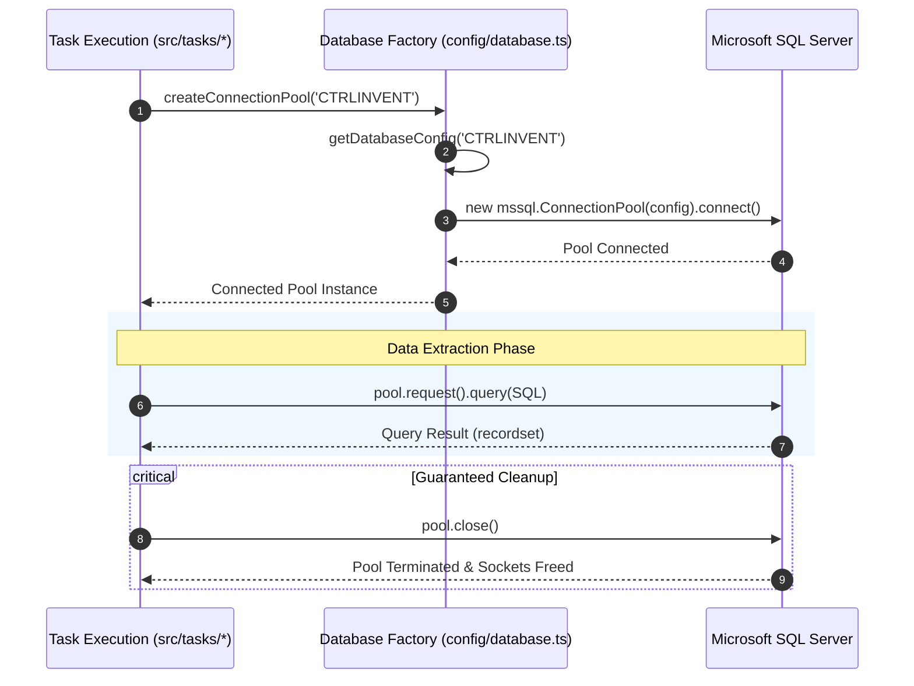

# ARCH-02: MSSQL Database Connection Engine

## 1. Overview & Architectural Role
The **Database Connection Engine** centralizes configuration, timeouts, and connection pooling for Microsoft SQL Server databases. Because tasks run intermittently (every few hours or minutes), connection pools are **created on-demand per task execution and disposed immediately upon completion**, preventing connection pool starvation on enterprise database servers.

---

## 2. Pool Lifecycle & Connection Architecture



---

## 3. Exported Public API

Located in [`src/config/database.ts`](file:///home/osvaldev/Documents/carnival/job-runner/src/config/database.ts):

### `DatabaseTarget` Type
```typescript
export type DatabaseTarget = 'CTRLINVENT';
```
*(Note: Additional targets such as `AX` and `SQL` can be restored in `getDatabaseConfig` as multi-server requirements evolve).*

### Functions

| Function | Signature | Description |
| :--- | :--- | :--- |
| `getDatabaseConfig(target)` | `(target: DatabaseTarget) => mssql.config` | Returns the driver configuration object for the designated target server. |
| `createConnectionPool(target)` | `(target: DatabaseTarget) => Promise<mssql.ConnectionPool>` | Instantiates a connection pool, connects to the database, and returns the active pool instance. |

---

## 4. Connection Configuration & Timeouts

The engine enforces standardized timeouts designed for heavy ERP queries:

```typescript
const commonConfig: Partial<mssql.config> = {
  connectionTimeout: 30000, // 30 seconds connection handshake timeout
  requestTimeout: 90000,    // 90 seconds query execution timeout
  options: {
    encrypt: false,         // Disabled for internal corporate SQL servers
  },
};
```

### Environment Variables
Mapped through [`src/config/env.ts`](file:///home/osvaldev/Documents/carnival/job-runner/src/config/env.ts):

| Variable | Config Key | Default | Description |
| :--- | :--- | :--- | :--- |
| `CTRL_DB_USER` | `ENV.DB.CTRL_DB_USER` | `'root'` | MSSQL authentication username |
| `CTRL_DB_PASSWORD` | `ENV.DB.CTRL_DB_PASSWORD` | `''` | MSSQL authentication password |
| `CTRL_DB_SERVER` | `ENV.DB.CTRL_DB_SERVER` | `'localhost'` | MSSQL host IP or hostname |
| `CTRL_DB_DATABASE` | `ENV.DB.CTRL_DB_DATABASE` | `'test'` | Default database name |

---

## 5. Invariants & Resource Guarantees

1. **Mandatory Disposal Pattern**:
   Any consumer of `createConnectionPool()` **MUST** use a `try / finally` construct:
   ```typescript
   let pool: mssql.ConnectionPool | undefined;
   try {
     pool = await createConnectionPool('CTRLINVENT');
     // execute query...
   } finally {
     if (pool) {
       await pool.close();
     }
   }
   ```
2. **Failure Isolation**:
   If the database server drops the connection during a query, the pool will automatically abort, releasing the socket and re-throwing a typed driver error (`mssql.MSSQLError`).
