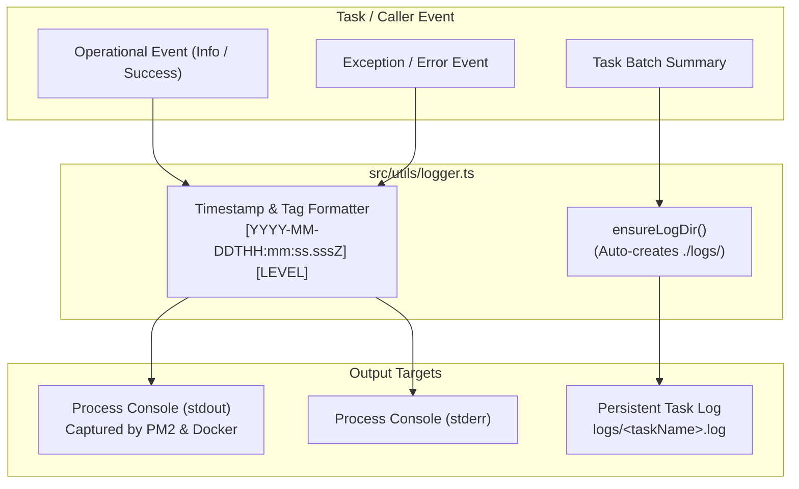

# ARCH-03: Logging & Local Audit Subsystem

## 1. Overview & Architectural Role
The **Logging & Local Audit Subsystem** provides a dual-channel recording strategy:
1. **Real-time Terminal Stream**: Color-coded, timestamped stdout/stderr output consumed by PM2 (`pm2 logs`) and developer terminals.
2. **Persistent Task Log Files**: Isolated, append-only file audit trails written to `logs/<taskName>.log` to retain historical synchronization summaries, duration metrics, and error traces.

---

## 2. Dual-Stream Telemetry Pipeline

---

## 3. Exported Public API

Located in [`src/utils/logger.ts`](file:///home/osvaldev/Documents/carnival/job-runner/src/utils/logger.ts):

| Method | Signature | Destination | Purpose |
| :--- | :--- | :--- | :--- |
| `logger.info(msg, ...args)` | `(message: string, ...args: unknown[]) => void` | `console.log` | Routine operational status |
| `logger.warn(msg, ...args)` | `(message: string, ...args: unknown[]) => void` | `console.warn` | Non-fatal anomalies or fallback states |
| `logger.error(msg, ...args)` | `(message: string, ...args: unknown[]) => void` | `console.error` | Caught exceptions and failed executions |
| `logger.success(msg, ...args)`| `(message: string, ...args: unknown[]) => void` | `console.log` | Milestone or completion confirmations |
| `logger.logToFile(task, msg)`| `(taskName: string, content: string) => void` | `logs/<taskName>.log` | Appends persistent execution reports |

---

## 4. Configuration & Storage Invariants

### Directory Resolution
- The audit path defaults to `<process.cwd()>/logs`.
- It can be overridden via `LOG_DIR` environment variable.
- The directory is automatically created synchronously (`fs.mkdirSync(LOG_DIR, { recursive: true })`) on the first write if it does not exist.

### Standard File Mapping
As described in [logs/README.md](file:///home/osvaldev/Documents/carnival/job-runner/logs/README.md):
- `logs/updateInventory.log`: Audit trail for inventory runs.
- `logs/updateDimensions.log`: Audit trail for product variations runs.
- `logs/livedashPush.log`: Audit trail for LiveDash operational pushes.
- `logs/logbookUpdateDB.log`: Audit trail for "The Courier" order extractions.

All files inside `logs/*.log` are git-ignored to prevent polluting version control.
