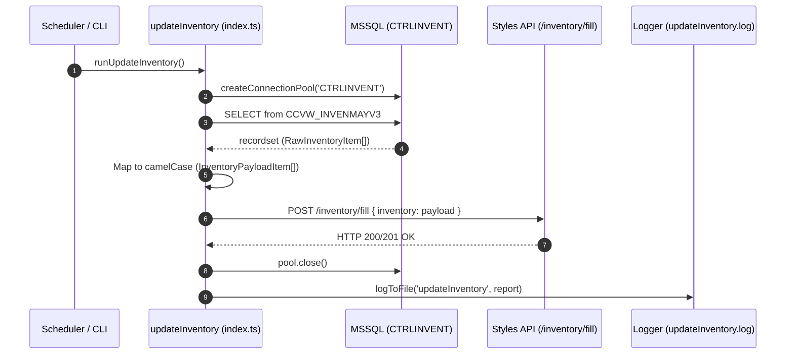

# TASK-01: Inventory Synchronization

## 1. Overview & Business Context
The `updateInventory` task synchronizes real-time product stock from the ERP view `CCVW_INVENMAYV3` into the web-facing Styles Information API (`/inventory/fill`). This provides customer-facing applications and sales channels with accurate counts of available and reserved garments broken down by style, color, cup, size, and quality.

---

## 2. Scheduling & Execution
- **Cron Schedule**: `0 7,12 * * 1-5` (Twice daily: 7:00 AM and 12:00 PM, Mon–Fri)
- **Status**: Enabled in scheduler ([src/scheduler/schedules.ts](file:///home/osvaldev/Documents/carnival/job-runner/src/scheduler/schedules.ts))
- **On-Demand CLI**: `npm run task:inventory`
- **Direct Entrypoint**: `tsx src/tasks/updateInventory/cli.ts`

---

## 3. Data Pipeline & Sequence Diagram



---

## 4. Extract Contract (Source Database)

- **Target Database**: `CTRLINVENT`
- **Source View**: `CCVW_INVENMAYV3`
- **SQL Query**:
  ```sql
  SELECT [ESTILO]
        ,[DESCRIPCION]
        ,[COLOR]
        ,[TALLA]
        ,[COPA]
        ,[CALIDAD]
        ,[DISPONIBLE]
        ,[RESERVA]
  FROM CCVW_INVENMAYV3
  ```

### Extracted Type Interface (`RawInventoryItem`)
Located in [`src/tasks/updateInventory/types.ts`](file:///home/osvaldev/Documents/carnival/job-runner/src/tasks/updateInventory/types.ts):

| Field | Type | Nullable | Description |
| :--- | :--- | :--- | :--- |
| `ESTILO` | string | No | Garment style code (e.g. `'20038'`) |
| `DESCRIPCION` | string | Yes | Human-readable garment description |
| `COLOR` | string | No | Color variation code |
| `TALLA` | string | No | Size code |
| `COPA` | string | No | Cup code |
| `CALIDAD` | string | No | Quality grade (e.g. `'1'`) |
| `DISPONIBLE` | number | No | Quantity physically available for sale |
| `RESERVA` | number | No | Quantity reserved by existing orders |

---

## 5. Transform Contract (In-Memory Processing)

Data is transformed into the API contract schema:
```typescript
const payload: InventoryPayloadItem[] = recordset.map((item) => ({
  style: item.ESTILO,
  size: item.TALLA,
  color: item.COLOR,
  cup: item.COPA,
  available: item.DISPONIBLE,
  reserved: item.RESERVA,
  description: item.DESCRIPCION ?? '',
  quality: item.CALIDAD,
}));
```

---

## 6. Load Contract (Target API)

- **Endpoint**: `POST ${ENV.API.STYLES_BASE_URL}/inventory/fill`
- **Payload Structure**:
  ```json
  {
    "inventory": [
      {
        "style": "20038",
        "size": "32",
        "color": "226",
        "cup": "C",
        "available": 140,
        "reserved": 12,
        "description": "BRASIER BALCONET",
        "quality": "1"
      }
    ]
  }
  ```

---

## 7. Invariants & Failure Modes

1. **Guaranteed Pool Disposal**: The connection pool is closed in a `finally` block regardless of query or HTTP failures.
2. **Detailed Error Logging**: If Axios rejects, error response bodies (`err.response?.data`) are extracted and written to `logs/updateInventory.log`.
3. **Execution Metrics**: Start time, end time, total duration in seconds, and item count are calculated and logged upon completion.
