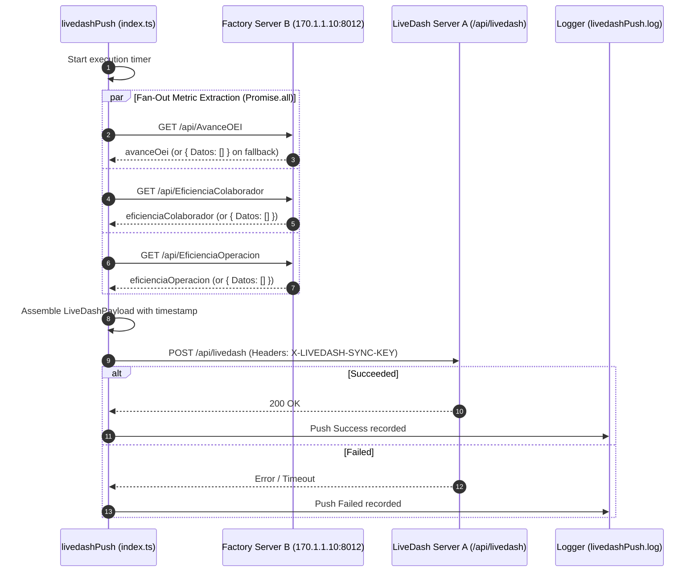

# TASK-03: LiveDash Operational Metrics Push

## 1. Overview & Business Context
The `livedashPush` worker extracts operational efficiency and packing progress indicators from the factory floor endpoint (Server B on local network `170.1.1.10:8012`) and pushes consolidated snapshots to the central LiveDash monitoring platform (Server A) every 15 minutes during operating hours.

---

## 2. Scheduling & Execution
- **Cron Schedule**: `*/15 8-19 * * 1-5` (Every 15 mins, Mon–Fri, 8 AM–7 PM)
- **Status**: Standby (disabled in [src/scheduler/schedules.ts](file:///home/osvaldev/Documents/carnival/job-runner/src/scheduler/schedules.ts))
- **On-Demand CLI**: `npm run task:livedash`
- **Direct Entrypoint**: `tsx src/tasks/livedashPush/cli.ts`

---

## 3. Data Flow & Sequence Diagram



---

## 4. Extract Contract (Source Server B)

- **Base URL**: `${ENV.API.LIVEDASH_SOURCE_URL}` (Default: `http://170.1.1.10:8012`)
- **Endpoints Fetched**:
  1. `GET /api/AvanceOEI`: Order execution progress
  2. `GET /api/EficienciaColaborador`: Operator efficiency metrics
  3. `GET /api/EficienciaOperacion`: Station efficiency breakdown

### Graceful Fallback Semantics
If any endpoint on Server B is unavailable or times out, the error is isolated with a warning log and defaults to an empty dataset:
```typescript
.catch((err) => {
  logger.warn(`[livedashPush] <Endpoint> request warning: ${err.message}`);
  return { Datos: [] };
})
```

---

## 5. Load Contract (Target LiveDash API)

- **Target URL**: `${ENV.API.LIVEDASH_TARGET_URL}` (Default: `http://localhost:3000/api/livedash`)
- **Authentication**: `X-LIVEDASH-SYNC-KEY: ${ENV.API.LIVEDASH_SYNC_KEY}`
- **Timeout**: 10,000 ms (10 seconds)
- **Payload Schema (`LiveDashPayload`)**:
  ```json
  {
    "avanceOei": { "Datos": [] },
    "eficienciaColaborador": { "Datos": [] },
    "eficienciaOperacion": { "Datos": [] },
    "pushedAt": "2026-09-10T15:00:00.000Z"
  }
  ```

---

## 6. Invariants & Failure Resilience
- **Network Isolation**: Failure of a single metric endpoint does not halt the overall snapshot push.
- **Request Timeout**: The POST request enforces a strict 10-second timeout to avoid lingering hung sockets.
- **Audit Records**: All outcomes (success response or HTTP error codes) are appended to `logs/livedashPush.log`.
