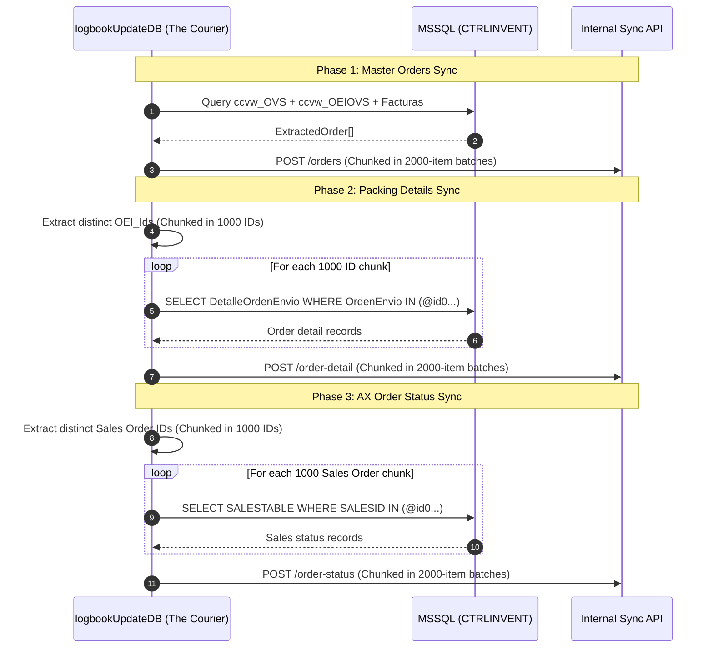

# TASK-04: The Courier (Logbook & Orders Synchronization)

## 1. Overview & Business Context
**"The Courier"** (`logbookUpdateDB`) is a multi-phase extraction pipeline that synchronizes sales order headers, packing progress, shipping status, and invoice relationships between Dynamics AX, local packing databases (`SeguimientoPedidos`), and the internal tracking web API.

---

## 2. Scheduling & Execution
- **Cron Schedule**: `0 13,19 * * 1-5` (1:00 PM and 7:00 PM, Mon–Fri)
- **Status**: Standby (disabled in [src/scheduler/schedules.ts](file:///home/osvaldev/Documents/carnival/job-runner/src/scheduler/schedules.ts))
- **On-Demand CLI**: `npm run task:logbook`
- **Direct Entrypoint**: `tsx src/tasks/logbookUpdateDB/cli.ts`

---

## 3. Multi-Phase Pipeline Architecture



---

## 4. Extract Contracts & SQL Queries

### Phase 1: Master Orders Query
```sql
SELECT
    a.OrdenVenta,
    a.NoCliente,
    a.Cliente,
    a.CantidadPzas,
    a.FechaCreacion,
    a.OrdenCliente,
    b.OEI_Id,
    b.OEI_Origin,
    a.Factura,
    c.Fecha_Facturacion
FROM ccvw_OVS a
INNER JOIN (
    SELECT
        OrdenVenta,
        MIN(FechaCreacionOEI) AS FechaCreacionOEI,
        OEI_Id,
        OEI_Origin
    FROM ccvw_OEIOVS
    GROUP BY OrdenVenta, OEI_Id, OEI_Origin
) b ON a.OrdenVenta = b.OrdenVenta
LEFT JOIN Facturas_Cobranza_Coleccion AS c ON a.Factura = c.NoFactura
```

### Phase 2: Packing Detail Query
```sql
SELECT
    [OrdenEnvio],
    [Estilo],
    [Color],
    [Talla],
    [Copa],
    [Piezas]
FROM [SeguimientoPedidos].[dbo].[DetalleOrdenEnvio]
WHERE [OrdenEnvio] IN (@id0, @id1, ...)
```

### Phase 3: Sales Status Query
```sql
SELECT
    [SALESID] AS [OrdenVenta],
    [SALESSTATUS] AS [StatusOrder]
FROM [ColeccionIntima].[dbo].[SALESTABLE]
WHERE [SALESID] IN (@id0, @id1, ...)
```

---

## 5. Chunking & Invariant Limits

To safeguard against network and database threshold limits:
- **`PARAMETER_CHUNK_SIZE = 1000`**: SQL Server enforces a hard ceiling of 2,100 parameters per parameterized query. Order IDs are strictly batched into sets of 1,000 to prevent query crashes.
- **`BATCH_SIZE = 2000`**: Records destined for the HTTP API are divided into batches of 2,000 items, preventing HTTP 413 (Payload Too Large) or socket timeout errors.

---

## 6. Load Contract (Target API)

- **Base URL**: `${ENV.API.SYNC_BASE_URL}`
- **Authentication**: `X-SYNC-API-KEY: ${ENV.API.SYNC_API_KEY}`
- **Endpoints**:
  - `POST /orders`: Array of `ExtractedOrder`
  - `POST /order-detail`: Array of packing items
  - `POST /order-status`: Array of order status codes

---

## 7. Failure Invariants & Audit Summary
- Each phase disposes of its database pool independently inside a `finally` block.
- At the end of the run, an aggregated report summarizing record counts and success/failure flags across all three endpoints is generated and recorded to `logs/logbookUpdateDB.log`.
