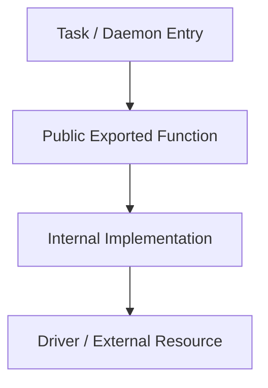

# ARCH-XX: Subsystem Name

## 1. Overview & Architectural Role
Brief explanation of the subsystem's role, why it is centralized, and how other components consume it.

## 2. Component Flow Diagram

## 3. Exported Public API
Description of interfaces, functions, and configuration helpers exposed by this module.

| Function / Symbol | Signature | Description |
| :--- | :--- | :--- |
| `doSomething()` | `(arg: string) => Promise<void>` | Core execution helper |

## 4. Configuration & Environment Variables
Lists all environment variables read from `src/config/env.ts` with their defaults and purpose.

| Variable | Type | Default | Purpose |
| :--- | :--- | :--- | :--- |
| `PARAM_NAME` | string | `localhost` | Connection endpoint |

## 5. Invariants & Error Semantics
- Lifecycle guarantees (cleanups, pool disposal, signal trapping).
- Error isolation and boundary behaviors.
