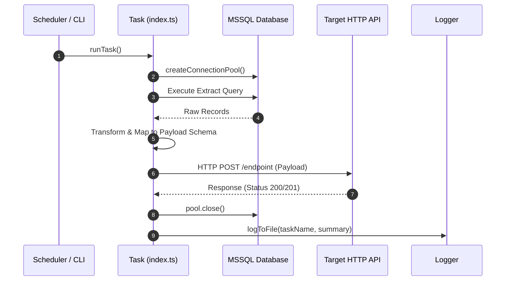

# TASK-XX: Task Name

## 1. Overview & Business Context
Brief 1-2 sentence description explaining the purpose of this task and why it exists.

## 2. Scheduling & Execution
- **Cron Schedule**: `0 7 * * 1-5` (Mon-Fri at 7:00 AM)
- **CLI Command**: `npm run task:<taskName>`
- **Direct Entry**: `tsx src/tasks/<taskName>/cli.ts`

## 3. Data Flow & Sequence Diagram


## 4. Extract Contract (Source)
- **Database Target**: `CTRLINVENT` | `AX` | `SQL`
- **Source View / Table**: `dbo.<TableName>`
- **Query**:
  ```sql
  SELECT [Field1], [Field2]
  FROM dbo.<TableName>
  ```
- **Source Schema (`RawItem`)**:
  | Field | Type | Nullable | Notes |
  | :--- | :--- | :--- | :--- |
  | `Field1` | string | No | Unique identifier |
  | `Field2` | number | Yes | Quantity count |

## 5. Transform Contract (In-Memory Processing)
- **Rules & Invariants**:
  - Filter out records where `Field1` is empty or matches exclusion patterns.
  - Apply default fallback values (e.g. `item.Field2 ?? 0`).
  - Map SQL uppercase columns to standardized camelCase properties.

## 6. Load Contract (Target API)
- **Method & Endpoint**: `POST ${ENV.API.<TARGET_URL>}/path`
- **Headers**:
  - `Content-Type: application/json`
  - `X-API-KEY: ${ENV.API.<KEY>}` (if applicable)
- **Payload Schema**:
  ```json
  {
    "items": [
      {
        "field1": "string",
        "field2": 0
      }
    ]
  }
  ```

## 7. Failure Invariants & Resilience
- Connection pools **must** be explicitly closed in a `finally` block.
- Non-200 responses must be logged to `logs/<taskName>.log` without masking the original Axios error message.
- Any unhandled exceptions must rethrow to let the caller (Scheduler or CLI process) register the failure.

## 8. Verification & Auditing
- Verify execution log in `logs/<taskName>.log`.
- Run on-demand CLI: `npm run task:<taskName>`
